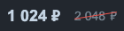

# vue-mzc-price
Simple Vue2 price component



[Online demo](https://codesandbox.io/s/angry-morse-byc4p?file=/src/App.vue)

## Installation
```sh
npm install vue-mzc-price --save
```

## Usage
```js
import VueMzcPrice from "vue-mzc-price";
import "vue-mzc-price/src/vue-mzc-price.css";

export default {
  components: {
    VueMzcPrice,
  },
};
```
```html
<vue-mzc-price :cost="1024" />
<vue-mzc-price :cost="2048" olden />
```